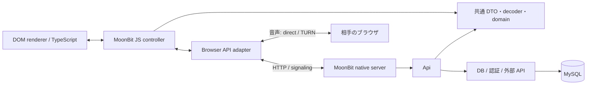

# アーキテクチャ

backend と frontend は同じ MoonBit の型・検証・ドメイン規則を、native と JS にそれぞれビルドする。
ブラウザ内の画面状態は JS にコンパイルした MoonBit が処理する。ネットワーク境界は JSON であり、
型共有とは別に入力検証を行う。

## 責務

| 場所 | 所有するもの |
| --- | --- |
| [core/conversation](../core/conversation)、[friendship](../core/friendship)、[matching](../core/matching) | I/O に依存しない状態遷移・ペア生成 |
| [core/identity](../core/identity)、[shared](../core/shared)、[wire](../core/wire) | ID、DTO、HTTP / WebSocket の入力検証 |
| [core/signaling](../core/signaling) | 一時的な接続と交渉の状態 |
| [core/api](../core/api) | HTTP 認可、ドメインの呼び出し、SQL、応答構築 |
| [core/native_server](../core/native_server)、[native_transport](../core/native_transport)、[native_io](../core/native_io) | 接続、会話ごとの順序制御、配送、HTTP 入出力制限 |
| [core/native_host](../core/native_host) | DB pool、driver 値の変換、鍵、外部 API |
| [core/shell](../core/shell)、[presenter](../core/presenter)、[thread](../core/thread) | 画面・フォーム・通信・音声の制御 |
| [frontend/src](../frontend/src) | DOM とブラウザ API。詳細は[フロントエンド](frontend.md) |
| [server](../server) | 比較用 Node backend、DB migration / seed |

## 設計判断

| 採用内容 | 理由・制約 |
| --- | --- |
| 業務規則を純粋関数、I/O を注入可能な `Api` に分離 | DB なしで規則と処理順を検証できる。認可・SQL 原子性は別途検証する |
| default backend は native、Node は比較用 | 稼働中の Node event loop を不要にする。Go より高速とは仮定しない |
| UI の状態は MoonBit、描画は標準 DOM | 描画方式を変えても業務ロジックを再実装しない。ブラウザ handle は TS adapter が保持する |
| MySQL と型付き statement を使用 | 現行 schema と transaction を維持する。SQL 方言変換・schema の静的検査は行わない |
| 公開 `Lifetime` と公式 `TaskGroup` を使用 | 終了と資源の受け渡しを集約する。独自 scheduler は持たない。通話 chunk の増加を許容する |
| 汎用の DB / WebSocket / lifetime は別ライブラリ | アプリは通話規則・認可・wire 契約に集中する。[配布単位](dependencies.md)を参照 |

## 型付き I/O

[Api](../core/api/host.mbt) は DB・認証・AI・時計・通知先を受け取るインスタンス。
native の `Runtime` が DB pool と RSA key を所有する。別の `Api` を呼んでも依存先は切り替わらない。

| 境界 | 表現 |
| --- | --- |
| SQL | `Statement { sql, params: Array[SqlValue] }`。parameter は scalar のみ |
| DB 応答 | `Rows(Array[DbRow])` / `Written(WriteResult)` |
| 認証・token | `AuthAction` / `Credentials`、`UserId -> String` |
| AI | `ChatKind` / `ChatReply`。処理は検証済み `content` を使う |
| エラー | `Credentials / NotConfigured / Conflict / Unavailable / InvalidData` を HTTP status に変換 |

native driver の値は直接 `SqlValue` に変換し、安全な整数範囲と重複列名を確認する。
Node adapter には文字列の `dispatch` FFI が残る。DB 行の DTO codec、HTTP の入出力、
AI provider の応答 metadata には JSON を使う。transaction は同じ接続で statement 列を実行し、最後の結果を返す。

## JS 境界と生成

[TS2Mbt / Mbt2TS](https://github.com/mizchi/ts.mbt) は呼び出し境界と型宣言の生成に使う。
アプリのロジックを自動移植するツールとしては使わない。

- `bindings/*.d.ts` → TS2Mbt → `core/platform` / `core/browser_platform`。
- MoonBit → `moon info` → `pkg.generated.mbti` → Mbt2TS → `dist/*.d.ts`。
- strict 生成で unsupported export / JSValue fallback を拒否する。標準 compiler の `any` を含む宣言は公開しない。
- JS へは具体的な struct・関数型を公開する。`Json / Map / Result / Option`、内部 enum、直接の `raise` / async ABI は公開しない。
- 同期入口は通常値か JS Error、非同期入口は具体型の callback を使う。opaque callback への変換は一致する関数型の `%identity` に限定する。
- struct の JSON 構造は共有するが、JS の prototype / object identity と plain object の同一性は保証しない。
- JSON の整数性と範囲は `FromJson` の前に確認する。ID は正の signed 32-bit、会話時刻は安全な整数の epoch milliseconds。
- `UserId / ConversationId / MessageId` は MoonBit 内で区別する。JS 表示 DTO は number のまま。

shared / thread / presenter は [core/client](../core/client) で一度だけ JS にリンクする。
[split-client.mjs](../scripts/split-client.mjs) が宣言間の依存を追い、画面別 ESM と共有 runtime に分割する。
共通 runtime の重複と、全画面の初期読み込みを防ぐためのアプリ専用処理である。
固定 compiler の出力形式に依存し、未対応の構文・初期化は build error にする。compiler 更新時は
[境界 fixture](../examples/js-boundary/README.md)と共有状態の同一性を再検証する。

## 資源の所有

画面の `Scope` はキーごとの処理の置換を担当し、解放を `Lifetime` に渡す。
起動ごとに親、要求ごとに子を作り、閉じた寿命は再開しない。独立した GET は並列実行し、
同じ要求の組がそろったときだけ反映する。停止・取消・再起動後の応答は旧画面へ反映しない。

通知 socket、認証の module 待ちと送信、マイク確認にも同じ所有規則を使う。
通話は `TaskGroup` を使い、同期 callback だけで足りる処理を一律に async 化しない。

- `stop()` は登録済み資源を同期解放して task をキャンセルする。
- 中断できない `getUserMedia` 等の遅い成功値、受け渡し中に取消された値も解放する。資源取得は `acquire(release~)` を使う。
- 成功 callback は所有を渡す。同じ資源を二度渡さない。別の成功値が重複した場合は `discard` で解放する。
- JS の同期例外は `guard_sync` で checked error に変換する。
- cleanup は同期・例外なし。`Inbox` は単一 reader。非同期 rollback は driver と公式 async の契約に従う。

DOM の `ViewScope` は cleanup の例外を集約して残りも解放するため、別の契約を持つ。
module 読み込みの世代管理は shell に残す。汎用実装・先行例・配布検証は
[moonbit-lifetime の設計](https://github.com/Hosi121/moonbit-lifetime/blob/main/docs/design.md)を正本とする。

## Native I/O

同期 DB 処理は10接続の C worker pool に分離し、MoonBit の event loop は完了通知を非同期に待つ。
worker に渡すのは C 側へコピーしたデータのみ。HTTP の取消後も実行中 job を回収してから接続を返す。
prepared statement と同一接続の transaction を使い、結果が不明な書き込みは自動再送しない。

会話の参加・開始・終了は会話ごとの mutex と DB の revision で順序付ける。
SDP / ICE の中継は DB を読まず、検証済みの元文字列を転送する。
WebSocket ごとに writer を一つ置く。HTTP 応答開始後の失敗では二つ目のエラー応答を送らず接続を閉じる。
async 0.22.1 の close 後に残る応答は、上限付きで drain してから TCP を閉じる。

JSON・RSA 検証・中継の CPU 処理は単一 event loop を共有する。
複数プロセスへの部屋分配、RTP 中継・トランスコードは実装範囲に含めない。
