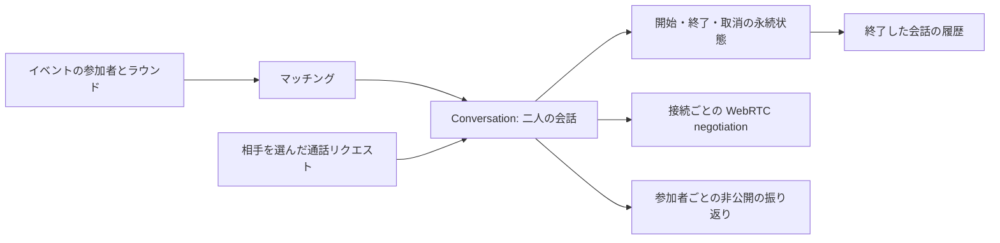

# 会話を中心にしたモデル

イベントの各ラウンドと、随時始める 1 対 1 通話を、同じ `Conversation` で扱う。イベントは会話を作るきっかけの一つであり、会話の開始・終了に必須の概念ではない。

## 三つの状態を混ぜない

| 対象 | 意味 | 保存先 |
| --- | --- | --- |
| 会話 | 誰と話すか、開始したか、終了したか | MySQL、`core/conversation` が遷移を検証 |
| 接続 | どの socket に誰がいるか、offer/answer が成立したか | `core/signaling` のメモリ上の状態 |
| 振り返り | その人の満足度・感想・学んだ表現 | 会話と本人をキーに MySQL に保存 |

`Active` は「開始済みで未終了」を表す。現在音声が届いているという意味ではない。切断時に negotiation は捨てるが、会話は終了させない。画面も接続状況と会話の残り時間を分けて扱う。再接続時は同じ会話 ID と開始時刻を使い、新しい negotiation を行う。

純粋な `core/conversation` はイベントも WebSocket も知らない。二人の ID、時刻、revision から検証済みの内部状態を復元し、コマンドを適用する。内部では enum、JS に渡す形では生成した DTO を使う。

| 現在 | コマンド | 結果 |
| --- | --- | --- |
| Planned | 両者の接続確認による begin | Active、開始時刻を一度だけ記録 |
| Active | begin の再送・再接続 | 開始時刻を保持 |
| Active | 参加者の finish | Completed、終了時刻を一度だけ記録 |
| Completed | finish の再送 | 終了時刻を保持 |
| Planned | 参加者の cancel | Cancelled、履歴に含めない |
| Cancelled | cancel の再送 | 取消時刻を保持 |

開始前の finish、開始後の cancel、完了後の begin、参加者以外の操作を拒否する。時計が巻き戻っても終了時刻が開始時刻より前にならない。revision は Planned=0、Active/Cancelled=1、Completed=2 と対応する。

## イベントと随時通話

随時通話は相手を選んで作る。作成者が付けた `request_id` と本人 ID の組を UNIQUE にし、並行再送でも同じ会話へ戻る。同じキーで相手を変える要求は 409。相手は一覧から参加を選び、マイクを許可する。招待の作成だけで相手のマイクを起動しない。招待は DB に通知として保存し、アプリ内の更新通知で一覧へ反映する。ブラウザを閉じた状態での OS Web Push は対象外。

イベントでは参加者を凍結してペアを計算し、会話と二つの参加行を一括公開する。公開済みマーカーも同じ transaction に入れ、ペアがゼロの場合も重複公開を拒否する。公開に失敗した凍結済みイベントは再実行できる。ペアリングの公平性を保証する最適化は別の課題。

`Conversation` 自体にラウンド数の上限はない。現在のイベント API の参加ビットと生成ポリシーは既存との接続部分として 3 ラウンド、通話の制限時間は 300 秒。随時通話は制限なし。同じ `conversationClock` を使い、期限の有無だけを変える。

イベントの時間切れはサーバーが永続した開始時刻から判定し、約 1 秒間隔で終了させる。全ブラウザが閉じていても進み、再起動後も期限超過分を回復する。終了時刻は開始 + 300 秒へ収束する。画面はサーバー時刻で時計ずれを補正して残り時間を表示し、時間切れの終了要求は送らない。処理は DB と同じ会話ロック・revision を使う。[期限と周辺機能](features.md)に運用上の範囲を記載。

## 保存するものを減らす

- `conversations`: 会話の状態と任意の `event_id` / `round_no`。
- `conversation_members`: 二人の参加者。seat は 0/1、同じ会話に同一人物を重複登録しない。アプリケーションの transaction で必ず二人を一緒に作る。
- イベント参加には `UNIQUE(event_id, round_no, user_id)` を設ける。旧 `user_a` / `user_b` 別々の UNIQUE では防げなかった、席を入れ替えた二重割当も拒否する。
- `conversation_reflections`: `(conversation_id, user_id)` ごとの upsert。本人の行だけ読み書きする。
- 履歴は Completed の会話の読み取り。別の履歴行へ複製しない。

一覧は本人の membership から会話を JOIN し、一度の SQL で二人とテーマを取得する。振り返りを一覧ごとに取得する N+1 はない。各一覧は直近 100 件で、ページングは未実装。

状態更新は `WHERE revision=?` を付ける。一度終了した会話への finish は書き込まずに既存値を返す。接続の受入れと begin/finish/cancel はプロセス内でも会話ごとの queue で順序づけ、古い DB 読み取りを使って終了後に再 join する競合を防ぐ。

SDP/ICE の中継はその queue や DB を通らない。JSON を検証して元の文字列を転送し、サーバ側では中継のためだけの再シリアライズをしない。両者の `media-ready` が揃ったときだけ begin を要求し、会話の snapshot は WebSocket で通知する。開始状態を知るための DB ポーリング、画面マウントからの推測タイマー、ブラウザ内だけのラウンドカウンタを廃止した。

`media-ready` は SDP/answer 完了後のブラウザの申告であり、サーバが RTP を検査した証明ではない。実装では `RTCPeerConnection.connectionState === 'connected'` から送り、双方の実音声受信をブラウザテストで別に検証する。

## JS 境界

共通 DTO、パーサー、残り時間、相手の選択は MoonBit にあり、TypeScript 型は Mbt2TS で生成する。日時は会話の時計計算用には整数の epoch milliseconds、既存 event/reflection 表示には ISO 文字列を使う。SQL の任意 event/round は NULL、平坦な wire DTO では両方 0 を「随時通話」とし、片方だけ 0 は拒否する。MoonBit の `Option` の内部表現は渡さない。

実際の JS 呼び出しで以下を検出し、境界の回帰テストを追加した。

1. この compiler では `raise` 付き関数の直接 export が内部の `Result` を返す。Mbt2TS の戻り値宣言だけでは防げなかった。公開する同期入口は `try!` で通常値か catch 可能な JS Error にし、MoonBit 内部は型付きエラーのまま扱う。生成処理が `raise` / async / Result / Option を直接公開する宣言を拒否する。[MoonBit のエラー処理](https://docs.moonbitlang.com/en/latest/language/error-handling.html)
2. `FromJson` の Int 変換は小数を切り捨てるため、変換前の Json に対して整数性と範囲を検証する。ID・revision・満足度に小数や範囲外の値を通さない。

これらを `Any` や unchecked cast で吸収していない。JSON は検証対象のデータであり、任意の JS object をドメインへ渡す経路にはしない。

## 検証と DB 更新

純粋な状態遷移を JS/native で検証し、JS 境界を実際に呼ぶテスト、MySQL と WebSocket の結合テスト、実ブラウザのイベント／随時通話を検証する。ブラウザでは双方の audio RTP、再接続、開始時刻の維持、終了通知、保存後の再読込、振り返りの非公開性を確認する。

初回移植の schema からは `db:migrate` が一度だけ旧 `rooms` をコピーし、ID を保つ。旧表は保存し、新コードは会話表を読む。再実行で完了状態を初期化しない。旧 FINISHED には時刻がないため時刻を捏造せず停止する。旧表に二重割当があった場合もコピーを rollback する。いずれも移植 repo 用の隔離 DB でテストしている。

元の Go/Ent DB の直接変換、本番切替、複数 signaling プロセスへの分散は対象外。native I/O サーバは実装し、JS と同じ結合・ブラウザ試験を通す。Go 比較用実装・JS・native の処理速度については [性能測定](performance.md) に条件と限界を分けて記載する。
