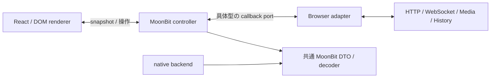

# 全画面の状態と通信制御を MoonBit へ

> 移行段階の記録（参照 revision: `e26c994`）。現在は全画面から React を削除済み。
> [現在の構成と測定](react-removal.md)を参照。以下の React 固有コードと数値は当時のもの。

メッセージに続き、認証フォーム、メモ、一覧、フレンド、イベント管理、設定、
振り返り、通知、WebRTC、マイク確認を移行した。目的は、React を交換するときに
状態遷移・通信順序・キャンセルを再実装せずに済む構成にすること。
通常アプリの renderer は React のままで、見た目と URL、API の契約を維持する。

アプリの `useState` / `useReducer` はなくなった。React の effect は mount/unmount、
外から来た入力の controller への転送、dialog などの DOM 操作に限定する。
PageBoundary の描画失敗状態と History API の購読は表示層に残す。

## 所有する責務

| 実装 | 所有するもの |
| --- | --- |
| `core/shell` | 認証の入力・表示・送信状態、module 待ちの世代、通知 controller の遅延起動、route 判定 |
| `core/presenter` | 画面の snapshot、取得・検索・保存、UI の選択・dialog・draft、エラーの解釈、通知と通話の寿命 |
| `core/thread` | メッセージの draft・ページング・送信・再送・既読・競合制御 |
| `core/shared` | frontend / backend 共通 DTO、入力検査、JSON decoder、会話の projection |
| `frontend/src/components` | snapshot に従う HTML / CSS、入力を controller へ転送、locale 表示 |
| `services/browser.ts` / `transport.ts` / `upload.ts` | HTTP、時刻、UUID、storage、History、timer、visibility、FormData の具体的操作 |
| `services/media.ts` / `realtime.ts` | 個々の media / socket API。native handle を closure 内で保持 |
| `services/controller.ts` | React の購読と mount/unmount。アプリ状態を複製しない |



controller は `get_snapshot` / `subscribe` / `start` / `stop` と画面固有の操作を公開する。
`get_snapshot` は変更まで同じ参照を返す。更新時は新しい record を発行し、過去の
snapshot の配列を書き換えない。利用側にも snapshot を変更しないことを要求する。
React は `useSyncExternalStore` を使うが、controller 自体は React を import しない。
DOM 版メッセージと、ブラウザのない MoonBit JS / native テストでも同じ方式を使う。

## 非同期処理とリソースの寿命

`core/presenter/runtime.mbt` の `Scope` は公開版 `Lifetime` を使い、キーごとに処理を所有する。要求を置換すると
前の要求を abort し、破棄・再起動後に届いた応答と二重 callback は無視する。
callback が同期的に呼ばれる port も扱える。`stop` は要求・timer・購読を解放する。
独立した二つの GET は並列に開始し、両方が完了してから一つの snapshot に反映する。
片方の失敗ではもう片方を中止し、異なる取得世代のデータを混ぜない。

フォームの送信中判定、初期値を読み込む前の編集抑止、検索結果の本人除外、
参加ビットの編集と更新の区別、随時通話の再送キーも controller に置く。
バックグラウンドの一覧更新が、保存・招待処理の busy を解除しないようにした。
通信エラーを理由に書き込みを自動再送する機能は追加していない。

通知は100 msの更新集約、60秒の復旧取得、1 / 2 / 4 / 8 / 16 / 30秒の再接続を
MoonBit が管理する。時計差は HTTP の開始・完了時刻の中点から求め、module 待ちを
含めない。既読応答を即時反映し、途中で新しい通知を取得済みなら古い一覧で消さず
再取得する。socket error と close の双方で接続の Lifetime を閉じる。

通話では JSON を一度だけ parse して内部の Signal enum にする。SDP / ICE の順序、
offer / answer、接続状態、mute、音量判定、終了時の後始末を MoonBit が判断する。
ICE 待機は従来の128件、非同期 SDP 処理待ちの signaling queue は256件を上限とし、
超過時は接続を解放してエラーにする。これは無制限だった待機に対する意図的な変更。
終了後のマイク許可は track を即時停止し、遅い SDP 完了は送信を進めない。
peer / socket / local・remote stream / AudioContext / audio 要素 / animation frame を
解放する。AudioContext の生成途中で失敗した場合も adapter が作成済み資源を閉じる。

マイク確認は同じ MediaPorts を使い、非表示中は frame を止める。音量の10帯域化と
発話閾値は元 TS の source oracle と比較する。画面を離れた後の遅い許可や、
StrictMode による start/stop の再実行も同じ世代規則で処理する。

## JS の配信と型境界

`bindings/browser.d.ts` から TS2Mbt で具体的な primitive を生成する。その他の port は
MoonBit の公開 record から Mbt2TS で生成した型を TS が実装する。File、MediaStream、
RTCPeerConnection を動的型へ消去して MoonBit に渡すことはしない。必要な操作だけを
持つ `Upload` / `StreamPort` / `PeerPort` で包む。手書きの Any / JSValue / TS any、
型引数だけで JSON を DTO とみなす API は追加していない。

HTTP adapter は body を text として一回読み、status と通信失敗を返す。
成功・エラーの JSON 検査と本文表示は MoonBit に集めた。multipart の境界はブラウザに
任せる。公開ログインには Bearer を付けず、token を検査してから保存する。

shared / thread / presenter を別々にリンクすると共通 runtime が重複する。
`core/client` で一度だけリンクしたあと、`scripts/split-client.mjs` が TypeScript AST と
symbol 解決で依存宣言を追い、画面別 ESM と共通 runtime に分ける。関数本体は変更せず、
局所変数による同名隠蔽、再帰、共有オブジェクトの同一性、prototype の tag を保つ。
`dist/shared.js` / `thread.js` / `presenter.js` は既存公開名を保つ facade になる。

この分割は固定した MoonBit 0.10.14 の生成形式に依存するアプリ内の処理。
未割り当て export、未対応の文や初期化呼び出し、mutable global などはビルドを失敗させる。
任意の JS の副作用を証明する汎用 bundler ではなく、compiler 更新時には再確認が必要。
Vite の副作用除外はこの生成 module 群に限定する。分割を導入した理由は、全 controller が
共通 chunk に入って画面の遅延読み込みを失うことを防ぐため。

`core/shell` は小さい別 entry とし、認証入力を共有 decoder の取得前に扱えるようにした。
型だけ presenter を参照し、データの検査・通信実装は入力時に先読みする。
cross-package 型は生成宣言で解決し、strict な独立 TS consumer で確認する。
依存 package の追加・削除・version 変更はない。

## 検証

- 凍結した旧 TS から通知10件、音量5件、HTTP エラー7件の expected を生成し、
  現在の MoonBit JS と比較。[source と再生成方法](../contract/frontend/README.md)。
- controller の port テスト24件で、古い応答、同期 callback、二重送信、並列 GET の
  片側失敗、通知既読と着信の競合、SDP / ICE の順序と上限、遅い media 許可を検証。
- 新 HTTP adapter の実 HTTP テスト5件。旧 adapter の5件は凍結 oracle の試験として区別。
- MoonBit JS 15件、native 16件、Node 129件、native API 結合19件が成功。
  TS2Mbt diagnostics、生成型・動的型の監査、TypeScript strict、lint、JS 境界試験も成功。
- Chromium の実 RTP 通話・再接続・画面操作を Node / native の両サーバで確認。
  各16ケースには、マイク取得後の AudioContext constructor / source 生成失敗時の
  track・context 解放も含む。production build の遷移・認証遅延・React / DOM 描画は32件。
- CI が生成物の差分を検査し、renderer に useState / useReducer / HTTP / JSON 処理を
  戻さないための AST 検査も行う。

この試験は対象を絞った source parity と操作・競合の回帰試験で、すべての非同期順序の
同値性を証明するものではない。ブラウザは Chromium、音声はローカルの実 RTP。
Safari / Firefox 実機、TURN 実回線、Supabase / OpenAI 実サービス、本番切替は未実施。

## 同条件の配信・応答比較

変更前は clean な `3561429e55a22d400702bf5df694670c52f2e721`、変更後は同 revision に
この移行を適用した commit 前の build。hash 付き asset 名を含む全測定を
[`bench/frontend-controller-results.json`](../bench/frontend-controller-results.json) に保存した。
2026-09-23 JST、Node 24.13.0 / MoonBit 0.10.14 / Vite 7.3.6 /
Chromium 153.0.8010.12、Intel Core Ultra 7 255H。React と依存の版は同じ。

| JS gzip bytes | 変更前 | 変更後 |
| --- | ---: | ---: |
| 未ログインの login 初回 | 53,429 | 58,010 |
| home 直開き | 106,957 | 107,885 |
| message 初回 | 104,774 | 109,318 |
| 通常アプリの全 JS 合計 | 131,806 | 153,787 |

login は8.6%、message は4.3%、全画面合計は16.7%増えた。ホームは0.9%増。
状態と寿命の管理を揃える変更であり、軽量化・高速化としては採用していない。
直接 runtime 依存は React / React DOM の2つ、lockfile 全228 package、non-dev 5 package。

| 初回表示の中央値 ms | loopback 前 → 後 | 通信・CPU 制限 前 → 後 |
| --- | ---: | ---: |
| login | 43.3 → 43.2 | 502.1 → 526.3 |
| home | 59.2 → 57.9 | 834.8 → 836.5 |
| message | 72.9 → 72.6 | 934.3 → 953.0 |

message の送信後表示は loopback 45.8 → 45.6 ms、制限下121.2 → 122.1 ms。
認証では module 待ちを含む即時入力と、34文字を30 ms間隔で入力する条件を比較した。

| 条件 | 入力 | 送信 → home ms 前 → 後 | ページ開始 → home ms 前 → 後 |
| --- | --- | ---: | ---: |
| loopback | 即時 | 45.6 → 45.5 | 158.4 → 157.9 |
| loopback | 30 ms 間隔 | 45.9 → 46.7 | 1,258.0 → 1,257.8 |
| 制限あり | 即時 | 438.4 → 408.7 | 1,085.5 → 1,089.6 |
| 制限あり | 30 ms 間隔 | 220.6 → 223.4 | 2,036.7 → 2,059.4 |

表示時間には小さい増減があるが、単一環境・各7試行で有意性は未確認。
制限は遅延40 ms、download 200,000 B/s、upload 93,750 B/s、CPU 4倍 throttling。
gzip HTTP/1.1、cache 無効、新規 browser context、warm-up 1回後に旧新を交互に測定する。
時刻はページ内の DOM 更新と2回の animation frame によるもので、LCP / INP ではない。
同じ HTTP fixture を使い、実 backend・DB・通知 socket の性能は測定に含まない。

現時点の単独メッセージも再測定した。同じ controller / 最小ホストに対して、
React 85,337 bytes → DOM 39,390 bytes、制限下の表示787.4 → 504.2 ms。
これは renderer を交換した同条件比較で、通常アプリ全体や MoonBit の計算速度の比較ではない。
通常アプリのほかの画面はまだ React で描画している。

## 再現

旧 revision の別 checkout と現在の checkout で README の toolchain 準備を行い、
それぞれ `npm run build:core`、`npm --prefix frontend run build` を実行する。
以下は現在の checkout から実行する。DB と `.env` は不要。

```bash
node bench/navigation.mjs capture frontend-before /path/to/3561429-checkout
node bench/navigation.mjs capture frontend-after /path/to/e26c994-checkout
npm --prefix /path/to/e26c994-checkout/frontend run build:message-views
cp -r /path/to/e26c994-checkout/_build/message-views _build/navigation-bench/frontend-after/views
node bench/navigation.mjs compare frontend-before frontend-after
node bench/navigation.mjs compare-auth frontend-before frontend-after
node bench/message.mjs frontend-before frontend-after
```

capture は同名を上書きしない。再試行は別 label にし、比較条件と全試行を保存する。
出力先は `_build/navigation-bench/`。アプリ全体から React を削除する場合も、
controller を変更せず各画面の renderer と mount/unmount を置き換える構成になった。
すべての画面の DOM 実装を今回作成したわけではない。
