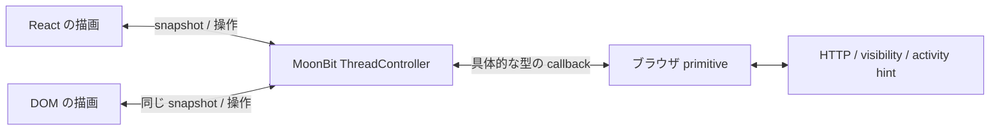

# MoonBit が所有するメッセージ画面

この文書は `3561429` までのメッセージ移行の記録。目的は、表示層を React から
DOM へ交換しても、状態遷移と通信制御を書き直さずに動かすこと。
続く変更で通知・通話・ほかの画面も移行した。[現在の構成と再測定](frontend-controllers.md)
を参照。以下の比較値はメッセージだけを移行した時点のもので、現在のサイズではない。

## 責務と型

`core/thread/controller.mbt` が下書き、送信中、履歴、ページング、エラー、
再送キー、既読の進捗、実行中リクエストを所有する。`ThreadController` は
`get_snapshot` / `subscribe` と `start` / `stop` / `refresh` / `set_draft` /
`send` / `load_older` を公開する。React の state に同じモデルを複製しない。

`ThreadPorts` は具体的な HTTP 送信、UUID、時刻の表示、visibility と更新通知の
購読だけを提供する。呼び出す順序、キャンセル、成功・エラー応答の解釈、
再送するかの判断は MoonBit にある。JSON はネットワーク境界で読み書きし、
描画のたびの JSON 往復はしない。実行されるのはブラウザ内の MoonBit 生成 JS。
バックエンドへ画面状態を送り、入力のたびに処理させる構成ではない。

`bindings/browser.d.ts` から TS2Mbt で `core/browser_platform` を生成する。
ホストの TS 実装もその宣言への代入可能性を検査する。ゼロ引数 callback に
TS2Mbt が opaque 型を生成するため、`browser.mbt` にその一つの関数型だけを
変換する `%identity` がある。汎用 cast や動的 object 型は使わない。
controller・snapshot・port の TS 型は Mbt2TS で生成する。

`get_snapshot` は変更がない限り同じ参照を返す。以前の snapshot を変更せず、
下書きだけの変更では messages 配列を共有する。利用側も配列・フィールドを
変更しない契約。React はメッセージ一覧を `memo` し、DOM 版は既存の要素を
message ID で再利用する。入力値が変わらないときは DOM の value を書き直さず、
選択範囲・フォーカス・変換途中の入力を維持する。



## 表示の切り替え

通常の `/message/:id` は既存の React アプリシェルを維持する。
`Message.tsx` は controller を作って描画へ渡し、実際の React view は
`frontend/src/message/react.tsx` にある。取得や統合を行う hooks はない。

`npm run dev` では同じ origin で次の比較用ページを開ける。先に通常の画面で
ログインしておけば、同じ認証情報で実際の API を利用できる。

- `/message-react.html?peer=2`: 最小の HTML ホストと React view。
- `/message-dom.html?peer=2`: 同じホストと `dom.ts`。React の実行コードを含まない。

比較用の production build は `npm --prefix frontend run build:message-views` で
`_build/message-views` に出す。通常の `frontend/dist` へ混ぜず、本番アプリの
コード分割に比較用 entry が影響しないようにする。ブラウザ試験では本番ビルドを
5174、比較用ビルドを5175で配信する。

単独ページは通知 WebSocket を起動しない。更新通知は host が `on_activity` の
入力として提供する責務であり、テストでは同じ `speakup:activity` event を
両方へ与える。通常のアプリでは `ActivityLayout` が接続する通知 controller が供給し、
他ユーザーからの着信メッセージも従来どおり更新する。単独ページはアプリ全体の
代替ではなく、描画の交換と性能比較のための entry。

## 互換性と修正

`018634f` の実際の reducer を `contract/message/reducer.js` に抜粋し、6 ケースの
expected を生成した。元の画面で先に通した4件の操作テストを、変更後の両 view
へ適用する。HTTP のパス・body・認証、未変更の本文の再送キー、既読が未読へ
戻らない統合、過去ページの保持、文字列の安全な表示を維持する。

次は意図的な修正。

- 古い最新ページの取得を中止し、遅れた応答・二重 callback を無視する。
- `stop` で全要求・購読を解放する。再起動後にも古い応答を受け入れない。
- 過去ページの取得と送信をそれぞれ一つに制限する。
- visibility の変化を直接受け取り、表示中の未読だけをまとめて既読化する。
  過去ページで表示した未読も対象。既読要求の失敗は無限再試行しない。
- 古い取得が新しいユーザー名を上書きしない。別の相手の応答を受け入れない。

MoonBit の標準 `String.trim` の既定値は空白・タブ・CR・LF の4種なので、入力検査に
そのまま使うと全角空白だけの送信が可能になる。元の JS と同じ
[ECMAScript WhiteSpace / LineTerminator](https://tc39.es/ecma262/multipage/ecmascript-language-lexical-grammar.html#sec-white-space)
を指定した。2,000 UTF-16 code unit の上限も維持する。

## JS のリンク

shared と thread を別々に JS へリンクすると、JSON / 文字列処理の runtime が
重複した。`scripts/client-bundle.mjs` が公開 export を委譲する `core/client` を
生成し、一度だけリンクする。MoonBit のソースパッケージは分離したまま、
`dist/shared.js` / `dist/thread.js` は公開名を保つ小さな ESM facade になる。
生の compiler `.d.ts` の cross-package record は動的型になるため、公開型は
各ソースパッケージの Mbt2TS 出力へ結び直し、従来の型監査も通す。

現在は presenter も同じ entry に含め、リンクした宣言を画面別 ESM へ分割する。
型の生成と runtime の共有は維持する。[分割の範囲と制約](frontend-controllers.md#js-の配信と型境界)。

この生成処理はアプリの同期・具体型 export に限定する。MoonBit の全構文を
扱う汎用 bundler ではない。新しい export を追加した際は `moon info` で
interface を更新してから生成する。ビルドは同じ出力先へ順番に実行する。

## 検証

- source reducer 6 ケースを含む JS controller の契約・競合テスト21件。
- ブラウザのない MoonBit JS / native で同じ controller のテスト4件。
- React / DOM の操作、入力保持、visibility、DOM 単独の依存とページ復帰を
  production build で確認。IME は composition event の再現であり OS の実 IME 試験ではない。
- 既存 Node / native backend の API、MySQL、ブラウザ試験も実行する。
- 生成宣言、TS2Mbt diagnostics、動的型、TypeScript strict、lint を検査する。

## 比較の再現

2026-09-23 JST、Node 24.13.0 / MoonBit 0.10.14 / Vite 7.3.6 /
Chromium 153.0.8010.12、Intel Core Ultra 7 255H で測定した。
変更前は `018634f` の clean build、変更後は同 revision に今回のパッチを適用した
build。依存バージョンは同一。比較用 entry を通常 build から分離した最終構成の値。

| 通常アプリの `/message/2` | 変更前 | MoonBit controller |
| --- | ---: | ---: |
| 初回 JS gzip bytes | 99,224 | 104,774 |
| 初回 JS リクエスト | 8 | 8 |
| 通常 loopback の表示中央値 | 94.4 ms | 90.8 ms |
| 通信・CPU 制限下の表示中央値 | 950.2 ms | 990.5 ms |
| 通常 loopback の送信後表示中央値 | 42.2 ms | 42.2 ms |
| 通信・CPU 制限下の送信後表示中央値 | 130.0 ms | 131.8 ms |

React を維持した通常アプリは初回 JS が **5,550 bytes（5.6%）増えた**。
全画面の JS gzip 合計も 126,217 → 131,806 bytes。React を残した状態での
高速化は主張しない。状態・寿命管理と renderer 交換を成立させた変更であり、
今回の採用理由は責務の分離。アプリ全体の配信量削減は今後の課題として残る。

| 同じ最小ホスト・同じ controller | React view | DOM view |
| --- | ---: | ---: |
| 初回 JS gzip bytes | 84,665 | 38,717 |
| 初回 JS リクエスト | 2 | 2 |
| 通常 loopback の表示中央値 | 77.9 ms | 68.7 ms |
| 通信・CPU 制限下の表示中央値 | 822.1 ms | 528.2 ms |
| 通常 loopback の送信後表示中央値 | 43.3 ms | 43.3 ms |
| 通信・CPU 制限下の送信後表示中央値 | 130.2 ms | 118.1 ms |

単独の同条件比較では JS が **54.3% 減**、制限下の初回表示中央値は35.7%短い。
同じ MoonBit controller を使っているため、これは renderer と配信の比較であり、
MoonBit の計算が TS より速いという結果ではない。制限は追加遅延40 ms、
download 200,000 B/s、upload 93,750 B/s、CPU 4倍 throttling。
両条件とも desktop viewport で、実機のモバイル性能は測定していない。

frontend の直接 runtime 依存は React / React DOM の2つ、lockfile の全228 package、
non-dev 5 package のまま。DOM のための新しいライブラリは追加していない。

```bash
# 変更前の checkout を build した後
node bench/navigation.mjs capture message-before
# 変更後の checkout を build した後
npm --prefix frontend run build:message-views
node bench/navigation.mjs capture message-after
cp -r _build/message-views _build/navigation-bench/message-after/views
node bench/message.mjs message-before message-after
```

実測結果は `bench/message-results.json`。同じ50件の履歴・送信応答、gzip HTTP、
新規 context、cache 無効、1回の warm-up と7回の測定を交互順序で行う。
通常のアプリ同士と、同一の最小ホストを使う React / DOM 同士を別々に比較する。
表示は DOM 更新と2回の animation frame で計測し、LCP / INP ではない。
MySQL、認証サーバ、通知ソケット、実機の通信時間の比較も含まない。
