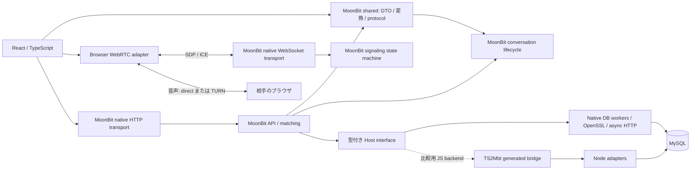

# 移植の範囲と判断

元コード: [Hosi121/SpeakUp](https://github.com/Hosi121/SpeakUp)、固定した commit と runtime は [contract/source.json](../contract/source.json)。元リポジトリへの変更はない。元の `.env`、アップロード済み画像、Git 履歴は持ち込んでいない。

## 構成



React の描画とブラウザの WebRTC オブジェクトを TS に残した。UI は標準 HTML/CSS で、MUI・Emotion と独自の `sx` / theme API は削除済み。Go の HTTP controller にあった入力検査、応答構築、ユーザー・メモ・イベント・フレンド処理は `core/api`、一時的な接続状態は `core/signaling`、ペア生成は `core/matching`。永続的な会話の開始・終了・取消は `core/conversation`。SQL も MoonBit 側に置き、アダプターは実行・トランザクション・SDK 呼び出しを担当する。

イベントのラウンドと随時通話を同じ会話で扱うよう、ドメインを再設計した。[会話モデル](domain-model.md)に遷移、参加者の制約、履歴・振り返り、接続との分離を記載している。

`core/shared` に DTO と画面向け変換を定義し、frontend と backend が同じ型を使う。画面固有の型・モック専用の型まで無理に共有していない。JS と native の両 target を持つ MoonBit module であり、frontend 全体を MoonBit の UI framework に書き直したものではない。

## 通話サーバのボトルネック

このアプリの Go サーバは SDP/ICE の交換だけを行い、音声 RTP や Opus の処理は行っていない。MoonBit 化は音声のエンコード速度に影響しない。WebRTC の signaling と peer connection は別の処理である。[WebRTC の接続手順](https://webrtc.org/getting-started/peer-connections)

元の `backend/controllers/signaling_controller.go` には以下があった。

- 接続ごとの goroutine が、ロックのない `clients` / `wsToId` / `idToWs` / `matchings` を更新する。
- 自接続への `callType` 送信と相手からの転送が同じ WebSocket に並行書き込みし得る。Gorilla は接続あたり一つの writer を要求する。[Gorilla v1.5.3 の concurrency contract](https://github.com/gorilla/websocket/blob/v1.5.3/doc.go)
- token の先頭を無検査で切り取り、JWT エラーを無視する。
- 接続時に DB client を開き直し、全イベントの MATCHED session を取得する。`event_id` 引数を使っていない。
- 切断時に identity と接続の逆引きが残る。

frontend でも offerer と開始回数が render 内のローカル変数、開始を固定タイマーで推測、PeerConnection を二重作成、remote description 前の ICE を保持しない、LAN 内 IP の固定、といった問題があった。

新構成は認証後に DB で room membership を一回調べ、接続後は MoonBit の map で転送先を引く。待機→両者到着→offer→answer の順序を検証し、切断・重複接続を扱う。1 接続あたり 64 KiB/frame、100 messages/sec、送信 backlog 256 KiB、認証待ち 5 秒、ping/pong と全体接続数の上限を持つ。

native でも JS/Node でも、JSON 検証・認証・転送が一つの event loop の CPU を共有する。native は DB の同期処理を C worker に分離するが、CPU の並列処理を自動で増やす構成ではない。大きな同期処理、接続急増時の RSA 検証、DB pool の待ち、遅い接続への送信が候補になる。部屋単位の状態は一つのプロセスにあるため、複数プロセス化には同じ部屋を同じ所有者へ送るルーティングが必要。この版は単一プロセスを対象とする。

異なる NAT 間で直接つながらない場合は TURN が必要。`/rtc-config` はサーバ側の TURN secret から期限付き credentials を作る。ローカル試験は host candidate であり、実インターネット上の TURN 実機試験は未実施。[TURN の説明](https://webrtc.org/getting-started/turn-server)

音声をサーバで多人数中継する SFU やトランスコードへ拡張する場合は、今回の signaling の測定は判断材料にならない。RTP/RTCP・DTLS/SRTP・帯域制御等の実装とバインディングを別途評価する必要がある。

## JS 境界と TS2Mbt

[mizchi/ts](https://github.com/mizchi/ts.mbt) の npm 版 `@mizchi/ts@0.6.0` を固定して利用。現在の上流 CLI は `mtsc bridge` / `mtsc pkg`、この版には `ts2mbt` / `mbt2ts` alias がある。TS2Mbt は型宣言から呼び出し境界を生成するツールであり、React のロジックを自動移植するトランスパイラとしては使っていない。

```
bindings/host.d.ts -- TS2Mbt --> core/platform/bridge.mbt
core/* -- moon info --> pkg.generated.mbti -- Mbt2TS --> dist/*.d.ts
```

- `npm run generate` は strict mode で実行し、unsupported export / JSValue fallback を拒否する。生成診断は `core/platform/SCAFFOLD_DIAGNOSTICS.md`。
- Promise を直接公開する形は生成ランタイムに動的な型を持ち込んだため採用しなかった。`dispatch(request: string, done: (error: string, value: string) => void)` にし、MoonBit の `%async.suspend` に接続した。async を TS に公開するときも callback で戻すので、非同期 ABI が外へ漏れない。
- TS2Mbt が callback に付ける opaque 型への変換だけ、正確な関数型を持つ `%identity` を一箇所使う。汎用 cast はない。この関数型が入力宣言と一致することを生成・型チェック・結合テストで確認する。
- `moon build` の標準 `.d.ts` は struct を `any` にするため、その出力を直接配布しない。Mbt2TS が生成した interface から、実際の `moon.pkg` の export 一覧に一致する宣言と構造型を機械的に抽出する。trait method は JS export ではないため公開しない。生成結果を手編集しない。
- MoonBit struct は JS で class instance。JSON の構造は一致するが、`Object.getPrototypeOf` や `instanceof` まで既存の plain object と同じではない。純粋な型変換の fixture は JSON 構造で比較する。MoonBit の Json/Map/Result/内部 enum は公開境界へ渡さない。
- legacy の省略可能な memo は MoonBit の HTTP decoder で空文字へ正規化する。ICE candidate の nullable field は protocol decoder で個別に検証し、`/rtc-config` の URL と credentials も MoonBit で検査してブラウザ用の具体的な型へ渡す。
- `raise` を直接 export すると内部 Result が JS に漏れる compiler 挙動を実呼び出しで検出した。同期の公開入口は通常値か JS Error に変換し、直接 export を生成時に拒否する。Int の FromJson は小数を切り捨てるため、元の Json に対して整数性・範囲を検証する。[境界の回帰テスト](../tests/conversations.test.mjs)
- DB の ID は signed 32-bit Int。HTTP/WS 入力で整数と範囲を検証する。会話の時刻は整数の epoch milliseconds（Double の安全な整数範囲）、既存 event/reflection の表示時刻は ISO 文字列。任意の event/round は両方 0 を随時通話とする平坦な DTO で渡し、Option の内部表現を公開しない。
- `Json` はネットワーク・DB のシリアライズに使う。ドメインの任意 JS object としての `Any` は使わない。`npm run check` が手書き TS、MoonBit、生成 bridge、公開宣言を検査する。

`mizchi/js` / `mizchi/npm_typed` / `mizchi/x` も用途を確認した。初回は JS target と小さな host interface を TS2Mbt で生成した。現在は業務 API に型付き Host を注入し、native は MoonBit async と Connector/C・OpenSSL、JS は従来の生成 bridge を使う。frontend の DTO とドメインモデルを共通に保ち、実行環境の依存を分離する。[native の構成・検証・制約](native.md)。

Mbt2TS の公開宣言には JS export から到達する型だけを抽出する。native 専用の async Host や内部 Json interface は TypeScript ABI へ出さない。MySQL の native binding は全て opaque な型と具体的な引数・返値を持ち、任意の JS 値に相当する型を導入しない。

## 意図的な変更

| 項目 | 移植先の決定 |
| --- | --- |
| WebSocket Authorization | `room` を必須化。JWT 検証とその部屋の参加者確認をしてから join |
| callType | 両者が来てから通知。false も明示。旧 Go の省略された false は decoder で受理 |
| JWT | RS256 のみ、issuer/audience を検証し exp を必須化。user_id は正の整数の十進文字列。既存の JWT を引き継がず再ログイン |
| event 作成 | ADMIN/SUPERUSER のみ。30 分。timezone なしは旧 Go と同じ UTC、返却は UTC に正規化 |
| friend | 2 人につき 1 行。受信者の承認で成立し、双方からメッセージを送れる。既存の片方向登録は申請中へ移行 |
| 空の一覧 | `null` ではなく `[]` |
| 会話・参加者 | event/round は任意。会話と二人の参加行を一括保存し、同一 event/round 内の二重割当を席の位置によらず拒否 |
| 随時通話 | 対象ユーザーを指定して作成、request_id で並行再送を集約。相手も明示的に参加 |
| 開始・終了 | 両者の media-ready で開始。終了は参加者の操作またはイベントの 300 秒期限、時刻はサーバ保存。再送・再接続で開始終了を重複記録しない |
| 振り返り・履歴 | 本人だけの記録を保存。履歴は終了済み会話の projection。キャンセルした予定は含めない |
| pairing | rank 順、round で片側を回転。参加ビットと重複 ID を検証。奇数なら未ペアの一人は待機。全員の完全公平性・全 round の重複最小性を保証する最適化ではない |
| roster 更新 | matching 開始時に event 行をロックして roster を凍結。公開 marker と会話を transaction で一括保存。空の結果も重複実行は 409、部分公開しない |
| DB | MySQL は維持するが新規 schema。Ent の edge 列を使う旧 DB をそのまま接続しない |
| メモ | user_id の UNIQUE と upsert で同時更新の重複作成を防止 |
| avatar | 2 MiB 上限、画像形式確認、暗号学的乱数による保存名、設定された公開 origin |
| chat | 認証必須、20 秒 timeout。model は環境変数で変更可能 |
| UI dependencies | MUI / Emotion を削除。標準 form / dialog / radio / nav と CSS、少数の型付き React 部品へ。詳細は [frontend](frontend.md) |
| frontend HTTP | Axios を削除し標準 fetch へ。Bearer 認証・HTTP エラー・multipart を維持。成功応答を共通 MoonBit decoder で検査し、不正な token は保存しない。通話準備中の退出で HTTP を abort。自動再送は追加しない。[契約と比較](http-client.md) |
| 画面遷移 | React Router を History API adapter と平坦な画面表へ。既存の URL・query・戻る/進むを維持し、未知のパスには戻り先を表示。画面を必要時に読み、遷移待ち中も前画面の media を解放する。[契約と比較](navigation.md) |
| 認証コードの配信 | ログイン／登録フォームを先に表示し、入力時に service と共有 MoonBit decoder を先読みする。準備完了後に API を送信し、読み込み待ち中に離れたフォームからは送信しない。初回表示と送信後の待ちを分けて比較する。[構成・制約](auth-loading.md) |
| メモの初回取得 | 画面の破棄・StrictMode の effect 再実行で古い取得を中止し、遅れて完了した応答が編集中の内容を上書きしないようにする |
| UI 操作 | `/` はサインインへ。フォームは Enter 送信可能、設定の画像選択とログアウト遷移を修正。マイクチェック終了時は取得した全 track を停止 |

これらはバグを含む既存動作の逐語的な互換再現ではなく、独立 repo としての意図的変更。既存サービスへの無停止切替を実施したものではない。

## 機能の対応

| API / 機能 | 状態 |
| --- | --- |
| `/signup`, `/signin` | Supabase HTTP adapter + MoonBit orchestration。ローカルは明示的な開発用認証 |
| profile / update / avatar / user search | 実装済み |
| memo / friends / events | 実装済み、MySQL 結合テストあり |
| `/ws`, `/rooms`, `/rtc-config` | 実装済み、二ブラウザの実 RTP 受信確認あり |
| `/events/:id/register`, `/events/:id/match` | 参加・マッチング API と参加者／管理画面を実装。参加ビット・待機者・公開状態を表示 |
| `/conversations`, `/conversations/direct`, `/conversations/:id` | イベント／随時の共通 API。参加者だけが読み書きできる |
| `/conversations/:id/finish`, `/cancel`, `/reflection` | 永続化と再送、並行操作を検証済み。開始 API は内部 WS controller 専用で HTTP からは不可 |
| `/conversations/history`, 会話履歴 UI | 終了した会話の一覧と本人の振り返りを実装。旧モックの `/conversation_history` API は公開しない |
| topics / sessions / session_history | 互換用 API。旧 `/session_history` はイベントに限定し、新 UI は共通の会話履歴を利用 |
| notifications / friends / messages / stats / AI feedback | 新モデルで保存・認可・集計と画面を実装。[機能と検証](features.md) |
| web-rtc-test の別試作 | 本体の通話経路へ統合、試作用 repo はコピーしていない |

## 検証と未実施範囲

実行環境との境界を別 repo の [moonbit-sessions](https://github.com/Hosi121/moonbit-sessions) へ抽出した。初期の一括 `servicekit` module を見直し、SQL の寿命管理・DB adapter・WebSocket の独立 module に分けて Mooncakes へ公開した。SpeakUp は `moon.mod` に必要な `Hosi121/sql_session@0.1.0` / `Hosi121/mysql@0.3.0` / `Hosi121/ws_session@0.1.0` を宣言する。ライブラリの開発用 submodule は削除し、`moon.work` はアプリと JS 境界の fixture だけを登録する。ライブラリ側の CI は各 module と独立 consumer、配布 ZIP を検証する。npm へのライブラリ公開は行っていない。

WebSocket の公開 API は ID を持たない `Session` と `with_session`。connection ID と signaling の登録・削除は `core/native_transport` が所有する。HTTP 入力制限と async 0.22.1 固有の close drain は `core/native_io` に置く。JSON 数値検査、空文字を成功とする callback、TS2Mbt / Mbt2TS の固定版と export 形式に依存する検査スクリプトは、一般的な bridge API と呼べる範囲ではないためアプリ内に残した。`examples/js-boundary` はその JS 実行・TypeScript consumer 契約を継続検証する。[mizchi のライブラリとの役割分担](https://github.com/Hosi121/moonbit-sessions/blob/main/docs/design.md)

DB pool はインスタンスごとに所有し、close 時に待機中の要求を拒否、実行中 worker は完了まで回収しない。ライブラリでは signed/unsigned 64 bit と Decimal / Blob を区別する。SpeakUp の JSON adapter は安全な整数範囲を確認して既存の number 契約へ戻す。WebSocket は従来の byte 上限に加え空 payload も数えるメッセージ数上限を持つ。この最初の抽出では外部依存の追加・更新をしていない。

引き継いだ frontend の依存更新と残る監査項目の判断は [依存関係の確認](dependencies.md) に記載した。

source oracle は `contract/source/` の元コード抜粋を実行して生成する。入力はケースとして定義するが expected は手書きしない。`npm run fixtures` で再生成でき、CI が差分を検査する。純粋変換と旧 Go の message/avatar シリアライズを対象にした structural parity であり、全 endpoint を旧稼働環境へ replay した比較ではない。

MoonBit type check / JS test / native core / crypto test、TypeScript strict check、frontend production build、JS/native 両方の MySQL API/WS integration（全 DB 接続のロック待ち中の中継を含む）、初回移植 DB の更新、Playwright 二ブラウザの音声受信と再接続・終了・振り返りを検証する。AI アドバイスはローカル HTTP fixture で試験する。Supabase/OpenAI への実 API 呼び出し、TURN 実回線、production traffic の shadow/replay、canary は未実施。元の Ent DB のデータ移行は別作業。元 Go repo を変更せず残しており、今回の公開による本番切替はない。


## 共通 SQL API への移行

`moonbit-sessions` に `Hosi121/sql_session@0.1.0` を追加し、MySQL adapter を 0.3.0 へ更新した。`core/native_host` は `Database[Value, Row, Command, TransactionOptions]` を保持し、query/transaction を共通の `run` / `with_transaction` で実行する。既存の host JSON 契約では引き続き最後の statement の結果を返すが、ライブラリの callback は途中の読み取り結果から次の処理を選べる。

共通層は接続の貸出期間、同一接続の同時操作拒否、待機上限と timeout、commit/rollback、キャンセル時の `errdefer` による後始末を管理する。SQL 方言と codec は adapter 側に残る。MySQL の行は列順を保つ配列になり、JSON 化で同名の列を検出した場合は上書きせずエラーにする。utf8mb4・UTC・matched-row count は SpeakUp の設定として明示した。

PostgreSQL adapter は既存の `moonbit-community/postgres@0.0.8` の client/pool を利用し、MySQL と同じ契約試験を通す。SpeakUp 本体は PostgreSQL module を import しておらず、アプリの SQL/schema を PostgreSQL へ移植したものではない。ライブラリの独立 consumer 検査では PostgreSQL もビルドする。[追加された検証用依存](dependencies.md)。WebSocket と JS の export / TS2Mbt / Mbt2TS の型境界は従来の契約検査で確認する。

セッション設定のリセットにはコストがある。今回の変更で Go や従来の pool より高速になったとは主張しない。SQLite adapter、sqlc によるクエリ型生成との統合、SQL 方言の変換は今回の実装範囲に含まない。

通知一覧と未読件数は同じ SQL 文で取得し、同時着信によって既読対象の ID と件数が食い違わないようにした。通話一覧の自動更新中も招待ボタンを操作できる。native HTTP は応答を開始した後の書き込み失敗で追加のエラー応答を送らず、その接続を終了する。大きい応答の途中で TCP を切断してもサーバが稼働し続けることを JS/native 両方で検証する。

### 既存実装への接続と配布単位

`servicekit.mbt` は `moonbit-sessions` に改名した。汎用 SQL 実装全体を保有する
方向を改め、`sql_session` は callback・transaction・キャンセルの寿命管理に絞る。
ライブラリは `moondb.AsyncDriver` を直接受け取り、既存の Value/Row/ExecResult を
変換せずに使用できる。第三者の `moonpostgres` でも共通の実 DB 試験を通した。
SpeakUp は native MySQL adapter の combined result API を継続使用する。

5 module を Apache-2.0 で2026-09-22に Mooncakes へ公開した。実際の ZIP と
registry から取得した公開版の双方で独立 consumer をビルドした。SpeakUp も
公開版で再ビルド・実 DB 試験を通し、暫定の submodule を削除した。
Frontend / npm / TS2Mbt の依存は変更していない。
