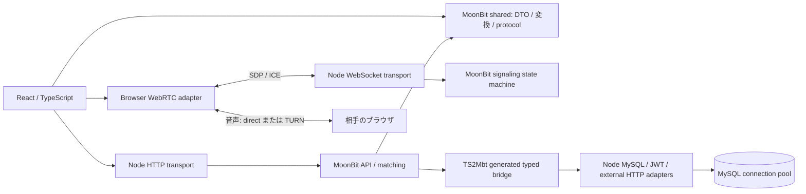

# 移植の範囲と判断

元コード: [Hosi121/SpeakUp](https://github.com/Hosi121/SpeakUp)、固定した commit と runtime は [contract/source.json](../contract/source.json)。元リポジトリへの変更はない。元の `.env`、アップロード済み画像、Git 履歴は持ち込んでいない。

## 構成



React/MUI の描画とブラウザの WebRTC オブジェクトを TS に残した。Go の HTTP controller にあった入力検査、応答構築、ユーザー・メモ・イベント・フレンド処理は `core/api`、部屋の状態は `core/signaling`、ペア生成は `core/matching`。SQL も MoonBit 側に置き、アダプターは実行・トランザクション・SDK 呼び出しを担当する。

`core/shared` に DTO と画面向け変換を定義し、frontend と backend が同じ型を使う。画面固有の型・モック専用の型まで無理に共有していない。JS target の一つの MoonBit module であり、frontend 全体を MoonBit の UI framework に書き直したものではない。

## 通話サーバのボトルネック

このアプリの Go サーバは SDP/ICE の交換だけを行い、音声 RTP や Opus の処理は行っていない。MoonBit 化は音声のエンコード速度に影響しない。WebRTC の signaling と peer connection は別の処理である。[WebRTC の接続手順](https://webrtc.org/getting-started/peer-connections)

元の `backend/controllers/signaling_controller.go` には以下があった。

- 接続ごとの goroutine が、ロックのない `clients` / `wsToId` / `idToWs` / `matchings` を更新する。
- 自接続への `callType` 送信と相手からの転送が同じ WebSocket に並行書き込みし得る。Gorilla は接続あたり一つの writer を要求する。[Gorilla v1.5.3 の concurrency contract](https://github.com/gorilla/websocket/blob/v1.5.3/doc.go)
- token の先頭を無検査で切り取り、JWT エラーを無視する。
- 接続時に DB client を開き直し、全イベントの MATCHED session を取得する。`event_id` 引数を使っていない。
- 切断時に identity と接続の逆引きが残る。

frontend でも offerer と開始回数が render 内のローカル変数、開始を固定タイマーで推測、PeerConnection を二重作成、remote description 前の ICE を保持しない、LAN 内 IP の固定、といった問題があった。

新構成は認証後に DB で room membership を一回調べ、接続後は MoonBit の map で転送先を引く。待機→両者到着→offer→answer の順序を検証し、切断・重複接続を扱う。1 接続あたり 64 KiB/frame、100 messages/sec、送信 backlog 256 KiB、認証待ち 5 秒、ping/pong と全体接続数の上限を持つ。

JS 出力の Node 実行では、JSON 検証・認証・転送が一つの event loop の CPU を共有する。大きな同期処理、接続急増時の RSA 検証、DB pool の待ち、遅い接続への送信が候補になる。部屋単位の状態は一つのプロセスにあるため、複数プロセス化には同じ部屋を同じ所有者へ送るルーティングが必要。この版は単一プロセスを対象とする。

異なる NAT 間で直接つながらない場合は TURN が必要。`/rtc-config` はサーバ側の TURN secret から期限付き credentials を作る。ローカル試験は host candidate であり、実インターネット上の TURN 実機試験は未実施。[TURN の説明](https://webrtc.org/getting-started/turn-server)

音声をサーバで多人数中継する SFU やトランスコードへ拡張する場合は、今回の signaling の測定は判断材料にならない。RTP/RTCP・DTLS/SRTP・帯域制御等の実装とバインディングを別途評価する必要がある。

## JS 境界と TS2Mbt

[mizchi/ts](https://github.com/mizchi/ts.mbt) の npm 版 `@mizchi/ts@0.6.0` を固定して利用。現在の上流 CLI は `mtsc bridge` / `mtsc pkg`、この版には `ts2mbt` / `mbt2ts` alias がある。TS2Mbt は型宣言から呼び出し境界を生成するツールであり、React のロジックを自動移植するトランスパイラとしては使っていない。

```
bindings/host.d.ts -- TS2Mbt --> core/platform/bridge.mbt
core/* -- moon info --> pkg.generated.mbti -- Mbt2TS --> dist/*.d.ts
```

- `npm run generate` は strict mode で実行し、unsupported export / JSValue fallback を拒否する。生成診断は `core/platform/SCAFFOLD_DIAGNOSTICS.md`。
- Promise を直接公開する形は生成ランタイムに動的な型を持ち込んだため採用しなかった。`dispatch(request: string, done: (error: string, value: string) => void)` にし、MoonBit の `%async.suspend` に接続した。async を TS に公開するときも callback で戻すので、非同期 ABI が外へ漏れない。
- TS2Mbt が callback に付ける opaque 型への変換だけ、正確な関数型を持つ `%identity` を一箇所使う。汎用 cast はない。この関数型が入力宣言と一致することを生成・型チェック・結合テストで確認する。
- `moon build` の標準 `.d.ts` は struct を `any` にするため、その出力を直接配布しない。Mbt2TS が生成した interface から、実際の `moon.pkg` の export 一覧に一致する宣言と構造型を機械的に抽出する。trait method は JS export ではないため公開しない。生成結果を手編集しない。
- MoonBit struct は JS で class instance。JSON の構造は一致するが、`Object.getPrototypeOf` や `instanceof` まで既存の plain object と同じではない。純粋な型変換の fixture は JSON 構造で比較する。MoonBit の Json/Map/Result/内部 enum は公開境界へ渡さない。
- legacy の省略可能な memo は TS 側で空文字へ正規化し、MoonBit には必須文字列を渡す。ICE の nullable field は protocol decoder で個別に検証する。
- DB の ID は signed 32-bit Int。JS の `number` 全域を Int とみなさず、HTTP/WS 入力では正の整数と範囲を検証する。日時は wire 上の文字列で扱う。
- `Json` はネットワーク・DB のシリアライズに使う。ドメインの任意 JS object としての `Any` は使わない。`npm run check` が手書き TS、MoonBit、生成 bridge、公開宣言を検査する。

`mizchi/js` / `mizchi/npm_typed` / `mizchi/x` も用途を確認した。この版は Node の既存 HTTP/WS/MySQL/JWT ランタイムと React を保つ JS target を選び、共通の小さな host interface を TS2Mbt で生成した。サーバ I/O の native 移植は実施していない。shared/signaling/matching の純粋部分は native でもコンパイル可能。native の I/O は [`moonbitlang/async`](https://docs.moonbitlang.com/en/latest/language/async-experimental.html) や [`mizchi/x`](https://github.com/mizchi/x) を次の候補にできるが、現測定から native サーバの速さを推測しない。

## 意図的な変更

| 項目 | 移植先の決定 |
| --- | --- |
| WebSocket Authorization | `room` を必須化。JWT 検証とその部屋の参加者確認をしてから join |
| callType | 両者が来てから通知。false も明示。旧 Go の省略された false は decoder で受理 |
| JWT | RS256 のみ、issuer/audience/exp を検証。既存の JWT を引き継がず再ログイン |
| event 作成 | ADMIN/SUPERUSER のみ。30 分。timezone なしは旧 Go と同じ UTC、返却は UTC に正規化 |
| friend 一覧 | 固定 Alice/Bob/Charlie モックからユーザー本人の DB 一覧へ |
| 空の一覧 | `null` ではなく `[]` |
| 部屋・マッチング | event と round を明示、ペアを一行で保存、参加表の record ID 混同を廃止 |
| pairing | rank 順、round で片側を回転。参加ビットと重複 ID を検証。奇数なら未ペアの一人は待機。全員の完全公平性・全 round の重複最小性を保証する最適化ではない |
| roster 更新 | matching 開始時に event 行をロックして roster を凍結。room の一括公開は transaction。重複実行は 409、部分公開しない |
| DB | MySQL は維持するが新規 schema。Ent の edge 列を使う旧 DB をそのまま接続しない |
| メモ | user_id の UNIQUE と upsert で同時更新の重複作成を防止 |
| avatar | 2 MiB 上限、画像形式確認、UUID の保存名、設定された公開 origin |
| chat | 認証必須、20 秒 timeout。model は環境変数で変更可能 |

これらはバグを含む既存動作の逐語的な互換再現ではなく、独立 repo としての意図的変更。既存サービスへの無停止切替を実施したものではない。

## 機能の対応

| API / 機能 | 状態 |
| --- | --- |
| `/signup`, `/signin` | Supabase HTTP adapter + MoonBit orchestration。ローカルは明示的な開発用認証 |
| profile / update / avatar / user search | 実装済み |
| memo / friends / events | 実装済み、MySQL 結合テストあり |
| `/ws`, `/rooms`, `/rtc-config` | 実装済み、二ブラウザの実 RTP 受信確認あり |
| `/events/:id/register`, `/events/:id/match` | 参加・マッチング API を追加。管理用 API、既存管理 UI への全面統合は未実施 |
| topics / sessions / session_history | DB を読む API を追加。room 終了の永続化・学習履歴の生成ワークフローは未完成 |
| conversation_history / notifications / achievements / AI feedback | 元 Go に対応 route がない、または UI モックのみ。新しい永続化を発明せず未実装として残した |
| web-rtc-test の別試作 | 本体の通話経路へ統合、試作用 repo はコピーしていない |

## 検証と未実施範囲

source oracle は `contract/source/` の元コード抜粋を実行して生成する。入力はケースとして定義するが expected は手書きしない。`npm run fixtures` で再生成でき、CI が差分を検査する。純粋変換と旧 Go の message/avatar シリアライズを対象にした structural parity であり、全 endpoint を旧稼働環境へ replay した比較ではない。

MoonBit type check / JS test / native core test、TypeScript strict check、frontend production build、MySQL API/WS integration、Playwright 二ブラウザの音声受信と既存画面を検証する。Supabase/OpenAI への実 API 呼び出し、TURN 実回線、production traffic の shadow/replay、canary は未実施。新 schema のため既存 DB のデータ移行も別作業。元 Go repo を変更せず残しており、今回の公開による本番切替はない。
