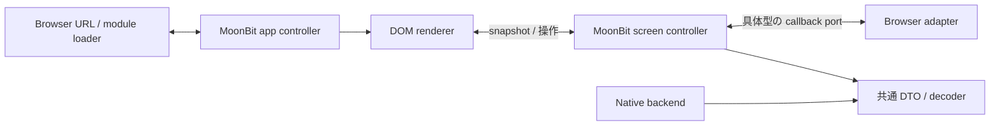

# React を外した frontend

`e26c994` の MoonBit controller を維持し、全画面の描画を標準 DOM に置換した。
React / React DOM / JSX / hooks / Context はアプリに残っていない。
frontend の実行時 npm 依存は0。代替の UI framework や仮想 DOM は追加していない。
既存の CSS、ロゴ、URL、API、画面操作を維持する変更で、backend の高速化ではない。

## 状態と描画の境界

| 実装 | 所有するもの |
| --- | --- |
| `core/shell/app.mbt` | route の同一性、module 待ちの世代、画面と通知 controller の寿命、失敗と復帰 |
| `core/shell/auth.mbt` | 認証フォームの値、送信と遅延 module の状態 |
| `core/presenter` / `core/thread` | 画面の snapshot、選択・draft・dialog、通信順序、通知・音声の状態 |
| `core/shared` | frontend / native backend 共通 DTO、入力検査と JSON decoder |
| `frontend/src/main.ts` | URL とクリックの読み取り、History API、dynamic import、失敗画面の DOM |
| `frontend/src/dom` / `message/dom.ts` | 要素の生成、snapshot の差分反映、イベントの転送、locale による表示 |
| `frontend/src/services` | fetch、storage、timer、File、MediaStream、WebSocket 等の具体的操作 |



残る TS は描画とブラウザの adapter。DOM node、購読解除関数、表示中の子 view、
行 ID と要素の対応は保持するが、フォーム値や通信状態を別の store に複製しない。
入力を controller へ渡し、返された snapshot に従って表示を更新する。
型は MoonBit から Mbt2TS、ブラウザ primitive は TS2Mbt で生成し、DTO の手書き複製や
Any / JSValue / TS any、汎用の unchecked cast を追加していない。

生成する JS とブラウザ DOM の境界自体は必要になる。型付き callback port で
操作だけを公開し、MediaStream / RTCPeerConnection などの実体は TS closure 内に置く。
TS を消すことと、アプリのロジックを MoonBit に集めることは別の達成条件として扱う。

## 画面とリソースの寿命

画面を離れた時点で購読と controller を破棄し、遷移先の JS を待つ間もマイク・接続を
保持しない。遅い module が戻っても現在の世代と異なれば mount しない。
mount 中の同期 redirect / failure でも、返ってきた破棄関数を一度だけ実行する。
token が変わると通知 controller を入れ替え、ログアウト後の遅い読み込みは起動しない。

`/session` / `/sessionrecord` / `/sessionfeedback` は conversation query を画面の
同一性に含める。ほかの query / hash 変更ではフォームを作り直さない。
戻る・進む、置換 redirect、修飾キー、新しいタブ、download、同一ページ内 anchor は
従来の契約を維持する。配信側には引き続き SPA fallback が必要。

`ViewScope` が購読と子 view の cleanup を所有する。停止を重複しても実行は一度。
描画失敗時は scope を閉じて復帰画面へ進み、一つの cleanup が失敗しても残りを解放する。
入力欄・audio・dialog を snapshot ごとに再生成せず、入力値が変わったときだけ value を更新する。
一覧は ID で行を保持し、消えた行の controller は破棄する。
フォーカス制限と復帰、Escape、radio のキー操作は標準 HTML に任せる。

キャッシュに残る pagehide ではアプリを破棄せずフォームを維持する。単独メッセージ
ページは以前どおり controller を停止・再開する。テストの cached restore はイベントを
明示送出した確認で、実ブラウザの BFCache 採用条件や通話中の復帰を保証するものではない。

ロゴは既存の SVG パスを独立した `.svg` に移した。外部 SVG として必要な namespace を
付与し、画像のデコードまでテストする。JS だけに着目して削減量を膨らませないよう、
測定では画像を含む初期 asset 総量も集計する。

## 依存と検証

直接 runtime 依存 2 → 0、lockfile の non-dev 5 → 0、全 package 228 → 172。
React 専用の Vite / ESLint / 型と不要になった Babel 等を削除し、残存 package の
version は変更していない。TypeScript / Vite / ESLint 等は開発用に残る。
native backend と比較用 Node backend、Mooncakes の依存は変更していない。

- MoonBit JS 16件、native 17件、Node 135件、native API 結合19件。
- Node / native 両 backend に対する Chromium の実 RTP 通話・再接続・画面操作は各16件。
- production build の遷移・認証遅延・DOM 描画は29件。以前の32件から削除済みの
  React 単独 renderer 用6件を外し、入力・一覧の要素同一性・SVG・React 不在の3件を追加。
- app controller の決定的な試験で、遅い module、二重 mount、同期 redirect、
  失敗後の遷移、token 変更、終了後の通知読み込みを確認。
- TypeScript strict / lint、TS2Mbt diagnostics、生成型・動的型監査、JS 境界契約、
  凍結 source oracle の再生成を検証。renderer への通信・JSON・アプリ状態の再導入も検査。

古いメモ応答の試験は React StrictMode の開発時二重 mount に依存していたため、
画面を離れて戻る操作へ変更した。遅い応答が編集済み draft を上書きしない検証は維持する。
読み込み表示は DOM の削除ではなく利用者から非表示になったことを確認する。
320 / 1024 px の配置とスクリーンショットを確認した。Firefox / Safari 実機、
スクリーンリーダー、TURN 実回線、本番配備は今回の検証に含まない。

## 配信量と表示時間

比較元は `e26c994`（React、状態は MoonBit）。比較先はこの文書と同じ commit の
DOM 実装。事前に保存した production build を同じプロセスから配信した。
Node 24.13.0 / Chromium 153.0.8010.12 / Core Ultra 7 255H、gzip HTTP/1.1。
各条件で新規 context、cache 無効、warm-up 1回 + 計測7回、実行順を交互にした。
[全試行・asset 一覧・環境](../bench/react-removal-results.json)を保存している。

| gzip bytes | React | DOM |
| --- | ---: | ---: |
| 未ログインのログイン初期 JS | 58,010 | 10,044 |
| 同 JS + CSS + ロゴ | 60,253 | 14,966 |
| ホーム直開き JS | 107,885 | 57,831 |
| 同 JS + CSS + ロゴ | 110,240 | 61,754 |
| メッセージ初期 JS | 109,318 | 61,745 |
| 同 JS + CSS | 111,561 | 64,037 |
| 全画面 JS 合計 | 153,787 | 102,406 |
| 全画面 JS + CSS + SVG 合計 | 156,142 | 108,959 |

ログインの初期 asset は75.2%減、全画面合計は30.2%減。全画面合計はファイルごとの
圧縮サイズを足したもので、初期配信量とは区別する。認証後には通知なども読み込む。
standalone DOM proof と開発用 JS はこの全画面合計に含めない。
SVG は JS から画像への移動分も含めて計上した。転送 header と HTML は含めない。

| 初回表示の中央値 (ms) | loopback React → DOM | 制限あり React → DOM |
| --- | ---: | ---: |
| ログイン | 61.5 → 48.3 | 582.1 → 257.9 |
| ホーム | 81.8 → 65.8 | 887.7 → 574.1 |
| メッセージ50件 | 118.4 → 94.5 | 1,091.1 → 746.8 |

「制限あり」は latency 40 ms、down 200,000 B/s、up 93,750 B/s、CPU 4倍抑制。
見出し／メッセージの DOM 変更と2 animation frame で測り、LCP / INP や画像の描画完了、
実機の体感速度を測ったものではない。API は同じ HTTP fixture、通知 WS は接続しない。

| ログイン開始からホームまでの中央値 (ms) | loopback React → DOM | 制限あり React → DOM |
| --- | ---: | ---: |
| 表示後に即時入力・送信 | 203.2 → 180.8 | 1,191.3 → 868.0 |
| 34文字を1文字30 msで入力・送信 | 1,327.5 → 1,296.1 | 2,458.1 → 2,042.3 |

認証処理の遅延ロードを含む。送信クリック後だけでは、制限ありの即時入力で
429.4 → 409.6 ms、30 ms入力で271.7 → 252.7 ms。初期表示だけを切り出して
入力後の待ち時間を隠す評価にはしていない。

暖まったメッセージ送信は loopback 41.9 → 42.1 ms、制限あり126.6 → 131.7 ms。
この操作の高速化は確認できなかった。採用理由は依存削減、描画層の交換可能性、
初期配信と表示の改善であり、すべての操作が速くなったという主張ではない。
React 単独 proof と DOM 単独 proof の比較も raw report に残すが、アプリ全体の
数字と混ぜない。Go / native backend の性能、実 DB 応答、TURN、実回線の評価ではない。

## 比較の再現

`e26c994` の別 checkout と現在の checkout に README の固定 toolchain を準備し、
両方で `npm run build:core` と `npm --prefix frontend run build` を実行する。
React 単独 proof を比較する場合は旧 checkout でも `build:message-views` を実行する。
次のコマンドは現在の checkout から実行する。DB と `.env` は不要。

```bash
node bench/navigation.mjs capture react-before /path/to/e26c994-checkout
cp -r /path/to/e26c994-checkout/_build/message-views _build/navigation-bench/react-before/views
node bench/navigation.mjs capture react-after
npm --prefix frontend run build:message-views
cp -r _build/message-views _build/navigation-bench/react-after/views
node bench/navigation.mjs compare react-before react-after
node bench/navigation.mjs compare-auth react-before react-after
node bench/message.mjs react-before react-after
```

capture は既存 label を上書きしない。再試行時は別名で保存する。
React proof は旧 revision の成果物を使い、現アプリに React を再追加しない。
